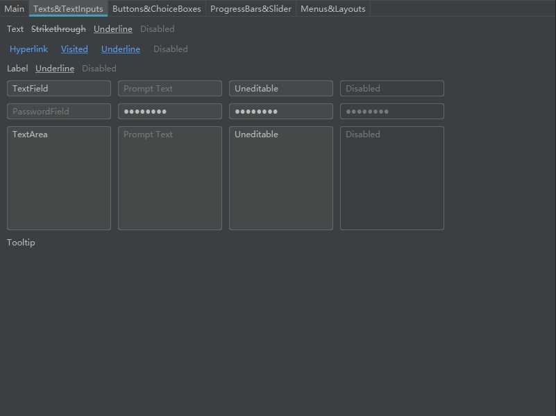
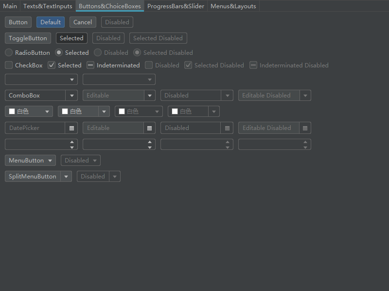
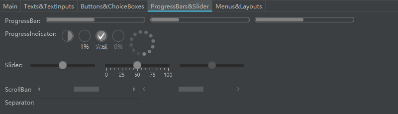
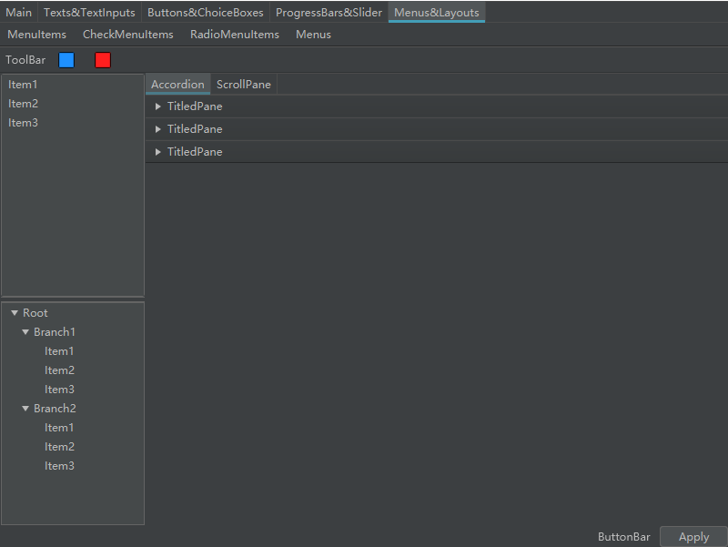

# darculafx

JavaFX Darcula theme

## How to use it

### Maven

Step 1. Add the JCenter repository to your build file

```xml

<repositories>
    <repository>
        <id>jcenter</id>
        <url>https://jcenter.bintray.com</url>
    </repository>
</repositories>
```

Step 2. Add the dependency

```xml

<dependency>
    <groupId>com.github.mouse0w0</groupId>
    <artifactId>darculafx</artifactId>
    <version>1.0.0</version>
</dependency>
```

### Gradle

Step 1. Add the JCenter repository to your build file

Add it in your root build.gradle at the end of repositories:

```gradle
	allprojects {
		repositories {
			jcenter()
		}
	}
```

Step 2. Add the dependency

```gradle
	dependencies {
	        implementation 'com.github.mouse0w0:darculafx:1.0.0'
	}
```

## Screenshots




